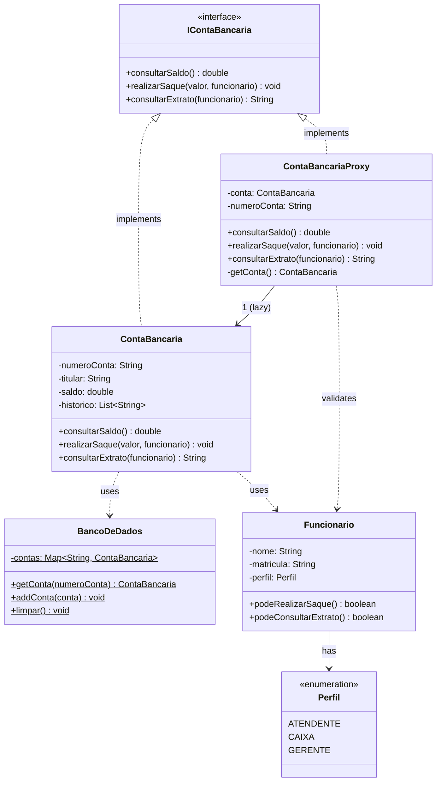

# Sistema Bancário — Padrão de Projeto Proxy

## Descrição
Projeto Java Maven que demonstra o **Padrão Proxy** aplicado a um sistema bancário simples.

O `ContaBancariaProxy` controla o acesso à `ContaBancaria` real, aplicando:
- **Lazy Loading**: a conta só é carregada do banco de dados quando realmente necessária.
- **Controle de Acesso**: valida o perfil do funcionário antes de executar operações sensíveis.

---

## Estrutura do Projeto
```
banco-proxy/
├── pom.xml
└── src/
    ├── main/java/br/com/banco/proxy/
    │   ├── IContaBancaria.java       ← interface (contrato)
    │   ├── ContaBancaria.java        ← classe REAL
    │   ├── ContaBancariaProxy.java   ← PROXY
    │   ├── Funcionario.java          ← entidade com perfis (ATENDENTE/CAIXA/GERENTE)
    │   └── BancoDeDados.java         ← repositório em memória
    └── test/java/br/com/banco/proxy/
        └── ContaBancariaProxyTest.java ← 10 testes JUnit 5
```

---

## Diagrama de Classes (Mermaid)


---

## Regras de Acesso

| Operação             | ATENDENTE | CAIXA | GERENTE |
|----------------------|-----------|-------|---------|
| `consultarSaldo()`   | ✅        | ✅    | ✅      |
| `realizarSaque()`    | ❌        | ✅    | ✅      |
| `consultarExtrato()` | ❌        | ❌    | ✅      |

---

## Como Executar

### Pré-requisitos
- Java 11+
- Maven 3.6+

### Rodar os testes
```bash
mvn test
```

### Compilar o projeto
```bash
mvn compile
```

---

## Testes (JUnit 5)

| Teste | Descrição |
|-------|-----------|
| `deveConsultarSaldoComQualquerPerfil` | Atendente consulta saldo com sucesso |
| `deveConsultarSaldoCorretoDaSegundaConta` | Saldo correto retornado da conta 002-2 |
| `deveCaixaRealizarSaqueComSucesso` | Caixa realiza saque e saldo é atualizado |
| `deveGerenteRealizarSaqueComSucesso` | Gerente realiza saque com sucesso |
| `deveNegarSaqueParaAtendente` | SecurityException ao tentar saque sem permissão |
| `deveLancarExcecaoSaqueSaldoInsuficiente` | Exceção ao sacar mais do que o saldo |
| `deveLancarExcecaoSaqueValorNegativo` | Exceção ao passar valor negativo |
| `deveGerenteConsultarExtrato` | Gerente consulta extrato completo |
| `deveNegarExtratoParaCaixa` | SecurityException ao caixa tentar extrato |
| `deveNegarExtratoParaAtendente` | SecurityException ao atendente tentar extrato |
| `deveLancarExcecaoContaInexistente` | Lazy load falha com conta inexistente |
